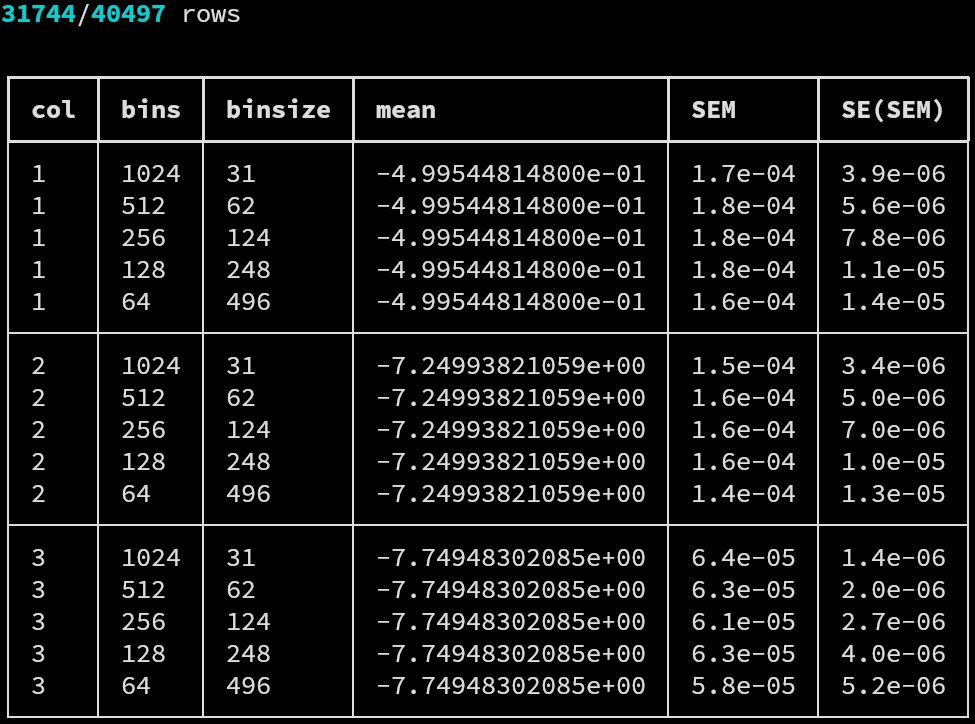
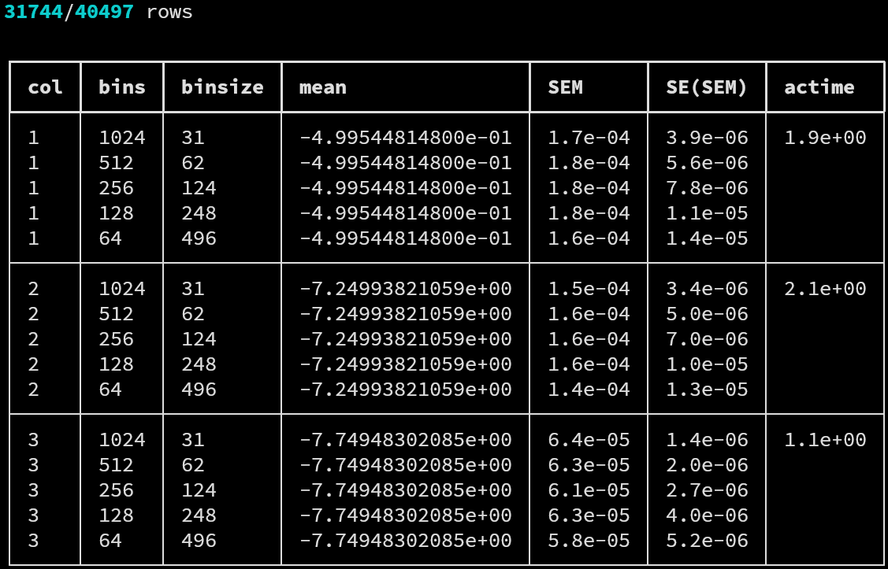

# `ave`

The `ave` driver allows to compute averages and estimate the
standard error of the mean (SEM) for correlated data via a
blocking procedure.


## Syntax

The call syntax can be printed running the commands

```
$ das ave -h
$ das ave --help
```

which yields the help message

```
usage: das ave [-h] [-f FIELDS] [-s SKIP] [-q] [-b] [-v] [-t] file

performs binsize scaling

positional arguments:
  file                  file to analyze

options:
  -h, --help            show this help message and exit
  -f FIELDS, --fields FIELDS
                        comma-separated, 1-indexed fields to analyze (default = all)
  -s SKIP, --skip SKIP  percentage (1-100) of rows to skip (default = 0)
  -q, --quick           skip row integrity check
  -b, --basic           simplified, parsing-friendly output formatting
  -v, --verbose         verbose output
  -t, --actime          computes autocorrelation time
```

The `ave`-specific options among the ones above are:

- `-t, --actime` adds a column in the result table containing
  the computed autocorrelation time for each column.

    The maximum among the binned SEMs is used in the
    autocorrelation time ratio, to obtain an upper bound.

Refer to the list of [common](common.md) arguments and options
shared by all drivers for further documentation.


## Output

A typical call to `ave` may look like

```
$ ./das ave -s20 -v -f 1,2,3 tests/data/ave-01.dat.gz
```

resulting in the output



where each subtable contains the data for different bin numbers
and binsize for the mean, the SEM, and the standard error on
the SEM (`SE(SEM)`). Quantities are computed as discussed in
the [correlated data](../statistics.md#correlated-data) section
of the *statistical introduction*.

Requesting the autocorrelation time as

```
$ ./das ave -s20 -v -f 1,2,3 -t tests/data/ave-01.dat.gz
```

will result in the modified output



Adding the `-b, --basic` option will result in the
parser-friendly, unformatted output

```
$ ./das ave -b -s20 -v -f 1,2,3 tests/data/ave-01.dat.gz
31744/40497 rows

1 1024 0031 -4.99544814800e-01 1.7e-04 3.9e-06
1 0512 0062 -4.99544814800e-01 1.8e-04 5.6e-06
1 0256 0124 -4.99544814800e-01 1.8e-04 7.8e-06
1 0128 0248 -4.99544814800e-01 1.8e-04 1.1e-05
1 0064 0496 -4.99544814800e-01 1.6e-04 1.4e-05
2 1024 0031 -7.24993821059e+00 1.5e-04 3.4e-06
2 0512 0062 -7.24993821059e+00 1.6e-04 5.0e-06
2 0256 0124 -7.24993821059e+00 1.6e-04 7.0e-06
2 0128 0248 -7.24993821059e+00 1.6e-04 1.0e-05
2 0064 0496 -7.24993821059e+00 1.4e-04 1.3e-05
3 1024 0031 -7.74948302085e+00 6.4e-05 1.4e-06
3 0512 0062 -7.74948302085e+00 6.3e-05 2.0e-06
3 0256 0124 -7.74948302085e+00 6.1e-05 2.7e-06
3 0128 0248 -7.74948302085e+00 6.3e-05 4.0e-06
3 0064 0496 -7.74948302085e+00 5.8e-05 5.2e-06
```

Which becomes, if the autocorrelation time is requested,

```
$ ./das ave -b -s20 -v -f 1,2,3 -t tests/data/ave-01.dat.gz
31744/40497 rows

1 1024 0031 -4.99544814800e-01 1.7e-04 3.9e-06 1.9e+00
1 0512 0062 -4.99544814800e-01 1.8e-04 5.6e-06
1 0256 0124 -4.99544814800e-01 1.8e-04 7.8e-06
1 0128 0248 -4.99544814800e-01 1.8e-04 1.1e-05
1 0064 0496 -4.99544814800e-01 1.6e-04 1.4e-05
2 1024 0031 -7.24993821059e+00 1.5e-04 3.4e-06 2.1e+00
2 0512 0062 -7.24993821059e+00 1.6e-04 5.0e-06
2 0256 0124 -7.24993821059e+00 1.6e-04 7.0e-06
2 0128 0248 -7.24993821059e+00 1.6e-04 1.0e-05
2 0064 0496 -7.24993821059e+00 1.4e-04 1.3e-05
3 1024 0031 -7.74948302085e+00 6.4e-05 1.4e-06 1.1e+00
3 0512 0062 -7.74948302085e+00 6.3e-05 2.0e-06
3 0256 0124 -7.74948302085e+00 6.1e-05 2.7e-06
3 0128 0248 -7.74948302085e+00 6.3e-05 4.0e-06
3 0064 0496 -7.74948302085e+00 5.8e-05 5.2e-06
```
