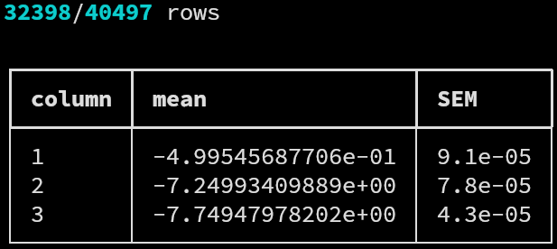

# `avs`

The `avs` driver allows to analyze uncorrelated data, by
computing averages, standard errors of the mean (SEM), and
standard deviation of the SEM for multi-column data files.


## Syntax

The call syntax can be printed running the commands

```
$ das avs -h
$ das avs --help
```

which yields the help message

```
usage: das avs [-h] [-f FIELDS] [-s SKIP] [-q] [-b] [-v] file

performs averages without rebinning

positional arguments:
  file                  file to analyze

options:
  -h, --help            show this help message and exit
  -f FIELDS, --fields FIELDS
                        comma-separated, 1-indexed fields to analyze (default = all)
  -s SKIP, --skip SKIP  percentage (1-100) of rows to skip (default = 0)
  -q, --quick           skip row integrity check
  -b, --basic           simplified, parsing-friendly output formatting
  -v, --verbose         verbose output
```

`avs` does not have specific options; refer to the list of
[common](common.md) arguments and options shared by all
drivers for further documentation.


## Output

A typical call to `avs` may look like

```
$ ./das avs -s20 -f 1,2,3 tests/data/ave-01.dat.gz
```

resulting in the output



where each row contains the statistical results for one of the
columns of the data set, and the quantities are defined as
discussed in the [uncorrelated
data](../statistics.md#uncorrelated-data) section of the
*statistical introduction*.

Adding the `-b, --basic` option will result in the
parser-friendly, unformatted output

```
$ ./das avs -b -s20 -v -f 1,2,3 tests/data/ave-01.dat.gz
32398/40497 rows

1 -4.99545687706e-01 9.1e-05
2 -7.24993409889e+00 7.8e-05
3 -7.74947978202e+00 4.3e-05
```
