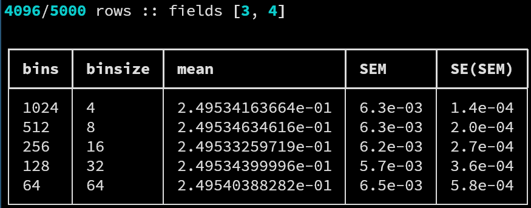

# `jck`

The `jck` driver allows to perform a jackknife estimation of
the value and error of functions of the mean value of data
sets.

`jck` accepts as argument a functional of one or more mean
values of the columns of the data set, for which the jackknife
estimation is performed. At present, the only available
functional is the *susceptibility*, defined as

$$
\chi(y_1, y_2) = y_1 - y_2^2
$$

where $y_i$ is the average of the $i$-th column of the data
set.


## Syntax

The call syntax can be printed running the commands

```
$ das jck -h
$ das jck --help
```

which yields the help message

```
usage: das jck [-h] [-f FIELDS] [-s SKIP] [-q] [-b] [-v] file

performs error estimation via jackknife

positional arguments:
  file                  file to analyze

options:
  -h, --help            show this help message and exit
  -f FIELDS, --fields FIELDS
                        comma-separated, 1-indexed fields to analyze (default = all)
  -s SKIP, --skip SKIP  percentage (1-100) of rows to skip (default = 0)
  -q, --quick           skip row integrity check
  -b, --basic           simplified, parsing-friendly output formatting
  -v, --verbose         verbose output
```

`jck` does not have specific options; refer to the list of
[common](common.md) arguments and options shared by all
drivers for further documentation.


## Output

A typical call to `jck` may look like

```
$ ./das jck -s10 -f 3,4 -v tests/data/jck-01.dat.gz
```

resulting in the output



where each row contains the estimation for different bin
numbers and binsize for the mean, the SEM, and the standard
error on the SEM (`SE(SEM)`) of the blocked pseudovalues.
Quantities are computed as discussed in the
[jackknife](../statistics.md#jackknife-analysis) and the
[correlated data](../statistics.md#correlated-data) sections of
the *statistical introduction*.

Adding the `-b, --basic` option will result in the
parser-friendly, unformatted output

```
$ ./das jck -s10 -f 3,4 -v -b tests/data/jck-01.dat.gz
4096/5000 rows :: fields [3, 4]

1024 0004 +2.49534163664e-01 6.3e-03 1.4e-04
0512 0008 +2.49534634616e-01 6.3e-03 2.0e-04
0256 0016 +2.49533259719e-01 6.2e-03 2.7e-04
0128 0032 +2.49534399996e-01 5.7e-03 3.6e-04
0064 0064 +2.49540388282e-01 6.5e-03 5.8e-04
```
